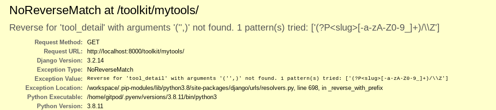

# Table of Contents 

1. [**Introduction**](#Introduction)
2. [**User Experience (UX)**](#User-Experience-(UX))
    * [Project goals](#Project-goals)
    * [Target audience](#Target-audience)
    * [User stories](#User-stories)
    * [Structure](#Structure)
    * [Design](#Design)

3. [**Features**](#Features)
    * [Existing Features](#Existing-Features)
    * [Features to be implemented in the future](#Features-to-be-implemented-in-the-future)

4. [**Technologies used**](#Technologies-used)

5. [**Deployment**](#Deployment)
    * [Deploying to Heroku](#Deploying-to-Heroku)
    * [Forking to GitHub Repository](#Forking-to-GitHub-Repository)
    * [Making a local clone](#Making-a-local-clone)

6. [**Testing**](#Testing)
    * [Testing Approach](#Testing-Approach)
    * [User stories testing from the UX section](#User-stories-testing-from-the-UX-section)
    * [Validator Testing](#Validator-Testing)
    * [Issues and Bugs](#Issues-and-Bugs)

7. [**Credits**](#Credits)

8. [**Acknowledgments**](#Acknowledgments)

9. [**Disclaimer**](#Disclaimer)

<br>

# MoodBox

[Live program](https://mood-box.herokuapp.com/)


## Introduction
---

MoodBox is a digital self-care toolbox for anyone feeling anxious, low or overwhelmed. It’s full of bite-sized information on psychological principles that are known to reduce negative feelings and enhance well-being. The users can pop it open whenever they need a quick remedy, a healthy activity to distract their anxious mind or simply a reminder that they are not alone. 

In MoodBox, they can learn how others use different tools and techniques to calm down their anxiety and lift their mood. They will find practical tips and discover new coping strategies that they implement whenever they need them. They can also share your own insights and everyday strategies to help others.


## User Experience (UX)
---
### Project goals

* 
* 

### Target audience

* 
* 

### User stories:

**Site User:**

* As a site user, I can quickly learn what the site is about so I can decide if it offers something I want.
* As a site user, I can navigate the site so that I can find the page I want to go to.
* As a site user, I can view a paginated list of tools so I can select a new technique to try.
* As a site user, I can open a post so I can see more information and steps necessary to use it.
* As a site user, I can view the number of likes on a tool post so that I can decide if this helped others.
* As a site user, I can view the comments on tools so I can see even more tips and suggestions.
* As a site user, I can follow any links leading to extra resources.
* As a new user, I can sign up for an account so that I can start adding my own tools and comment and like content posted by others.

**Registered User:**

* As a registered user, I can sign into my account so that I can access my tools.
* As a registered user, I can sign out of my account when finished, so that I know I am signed out securely.
* As a registered user, I can create and share my own tools and tips for others users to view.
* As a registered user, I can edit my post so that I can correct or add to the previously recorded information.
* As a registered user, I can delete my post so that I can remove it from my records. 
* As a registered user, I can comment on other users' tips to interact with the content.
* As a registered user, I can like or unlike tips other users shared so I can interact with the content.
* As a registered user, I can add links to the posts so that I can point to an official resources.

**Site Admin:**

* As a site admin, I can create, view, update and delete posts so that I can manage my site content.
* As a site admin, I can approve user-created posts and comments so that I can manage the content of the site.
* As a site admin, I can remove users so that they will no longer be able to post unsuitable content.

### Structure:

* Flowchart


* Database Structure


### Design: 


## Features
---

### Existing Features

* 

### Features to be implemented in the future

Due to time constraints, I was unable to implement all planned features. In the future, I'd like to add the following:

* 
* 
* 
* 

## Technologies used
---

### Languages 

* HTML
* CSS
* JavaScript
* Python (with Django framework)
* Django templating language 


### Frameworks, Libraries, Programmes and Tools 
 
* [Django web framework](https://www.djangoproject.com/) - used to build the project
* [Bootstrap 4.6](https://getbootstrap.com/docs/4.6/getting-started/introduction/) - for responsiveness, layout, modals, and general frontend style
* [Cloudinary](https://cloudinary.com/) - to host media files 
* [django-allauth](https://django-allauth.readthedocs.io/en/latest/index.html) - for user registration and authentication
* [Code Institute Template](https://github.com/Code-Institute-Org/python-essentials-template) - to display and run the command line terminal in the browser
* [dbdiagram](https://dbdiagram.io/home) - to create the database diagram model
* [Balsamiq](https://balsamiq.com/) - to create wireframes for the site as part of the preparation work for the project
* [Google Fonts](https://fonts.google.com/) - to import Courgette and Montserrat fonts into the HTML file which were then used throughout the site
* [Coolors](https://coolors.co/ ) - to create cohesive colour scheme for the site
* [Eye Dropper](https://eyedropper.org/) - to pick specific colours from images 
* [Favicon.io](https://favicon.io/) - to create a favicon for the site
* [Vecteezy](https://www.vecteezy.com/) - for images
* [Pixlr](https://pixlr.com/) - to edit and resize images
* [Chrome DevTools](https://developer.chrome.com/docs/devtools/) - to inspect and debug the code through all stages of the development
* [Unicorn Revealer](https://chrome.google.com/webstore/detail/unicorn-revealer/lmlkphhdlngaicolpmaakfmhplagoaln?hl=en-GB) - to inspect the site for overflow 
* [Lighthouse](https://developers.google.com/web/tools/lighthouse) - to audit the site for performance, accessibility, SEO and best practices
* [Am I Responsive](http://ami.responsivedesign.is/) - to produce a preview of the site on different devices
* [W3C HTML Validator](https://validator.w3.org/) - to validate HTML code
* [W3C CSS Validator](https://jigsaw.w3.org/css-validator/) - to validate CSS code
* [PEP8 Online Validation Service](http://pep8online.com/) - to validate the code
* [Color Contrast Accessibility Validator](https://color.a11y.com/Contrast/) - to test the contrast and readability of colours used 
* [Heroku](https://heroku.com/) - for presenting the deployed project
* [Heroku Postgres](https://www.heroku.com/postgres) - the database for the deployed project
* [GitHub](https://github.com/) - for hosting the project code and version control 
* [GitHub issues](https://github.com/) - used as Agile tools in the planning and implementation of the project
* [Gitpod](https://gitpod.io/) - to write the code and push it to GitHub
* [Online-Spellcheck](https://www.online-spellcheck.com/) - to spellcheck the README
* [Word Counter](https://wordcounter.net/character-count) - to limit number of characters used for commit messages to 50, max 72 characters


## Deployment
---
### Deploying to Heroku

[Deployed program on Heroku](https://mood-box.herokuapp.com/)

The project was developed in GitPod, committed to Git and pushed to GitHub. 
The site was deployed to Heroku with the following steps:

1. In GitPod, import the required dependencies to the requirements.txt file, using 
> pip3 freeze > requirements.txt
2. Git add, commit and push the saved changes to GitHub. Heroku will use this file to import the dependencies that are required.
3. Sign up and log in to [Heroku](https://heroku.com).
4. On the dashboard, click **New** in the top right-hand corner and select **Create New App**.
5. Select a *unique* name for your application and choose your region (Europe in my case).
6. Click **Create App**.
7. Navigate to the Settings tab (must be done before deploying code)
8. Go to section **Config Vars**, click button "Reveal Config Vars" and press "Add" button
9. 
10. 
11. 
12. Navigate to the Deploy tab and scroll down to **Deployment Method**.
13. Select GitHub as deployment method.
14. Enter the name of the repository you want to connect to and click **Connect**.
15. Select one of the deployment options - Automatic Deployments or Manual - to deploy the app.
16. Once successfully deployed, a **View** button will appear and take you to a mock terminal.


### Forking to GitHub Repository

You can create a fork (copy) of the repository. This allows you to experiment with the code without affecting the original project.

To fork the repository:

1. Log in to your [GitHub](https://github.com/) account 
2. On GitHub, navigate to the repository you want to fork
3. In the top right corner of the page, underneath your profile avatar, click **Fork**
4. You should now have a copy of the original repository in your GitHub account

### Making a local clone

You can clone your repository to create a local copy on your computer. Any changes made to the local copy will not affect the original project. To clone the **Winter Wedding** project, follow the steps below:

1. Log in to your [GitHub](https://github.com/) account and locate the [MoodBox repository](https://github.com/renatabiniek/moodbox)
2. In the repository, click on **Code** button located above all the project files
3. Under HTTPS, copy the link generated (https://github.com/renatabiniek/moodbox.git)
4. Open the terminal you're using, e.g. Gitpod
5. Change the current working directory to the location where you want the cloned directory created
6. Type ```git clone``` and then paste the URL you copied earlier:  
```git clone https://github.com/renatabiniek/moodbox.git``` 
7. Press **Enter** to create your local clone.

You can also refer to this [GitHub documentation](https://docs.github.com/en/github/creating-cloning-and-archiving-repositories/cloning-a-repository-from-github/cloning-a-repository) for detailed instructions. 

## Testing
---

### Testing Approach

* 

*


* The program has been tested on various browsers on desktop and mobile:

  * Chrome
  * Mozila Firefox
  * Edge
  * Safari 


### User stories testing from the UX section

I tested the program considering the user stories from the UX section as well.

* 

  **Test result:**  


### Validator Testing


### Issues and Bugs

* **Navbar collapsable not expanding to show links of the menu**

  The menu of the navbar was collapsing correctly when screen size got smaller but it wasn't expanding when clicked.  
  This was a simple oversight of not adding the js plugin to my code to handle the interaction. Resolved with help of [this Stackoverflow post](https://stackoverflow.com/questions/65911507/bootstrap-navbar-collapse-not-expanding-to-show-links-of-the-menu).

* **Getting 404 error after submitting a form**

  I was getting a 404 error after clicking submit button on my Comments form. Thanks to [this post](https://stackoverflow.com/questions/55364668/getting-404-not-found-code-after-submitting-form), I realised I missed adding value="Submit" to the form button. This has fixed the issue.

* **Getting NoReverseMatch error for newly created posts**
  
  This error came up When a new post is created in the front end by a logged in user. 
  I noticed that in the admin view the slug field was blank for these posts. This meant that the tool created didn't have a forwarding url 
  for the tool detail page to be populated. Using slugify, I coverted the tool name into a slug, and this has fixed the issue.

  

### Credits

* 

* 

* 

* 

### Acknowledgments

Thank you to:

* 
* 
* 

### Disclaimer

*This program has been created for educational purposes only, as part of Code Institute’s Portfolio Project.*

[Back to top](#Table-of-Contents)