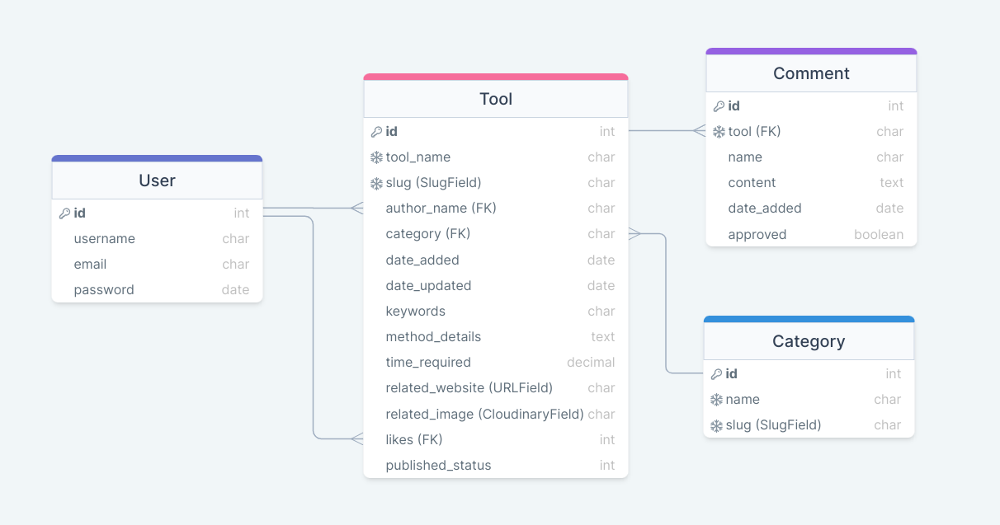

# Table of Contents 

1. [**Introduction**](#Introduction)
2. [**User Experience (UX)**](#User-Experience-(UX))
    * [Project goals](#Project-goals)
    * [Target audience](#Target-audience)
    * [User stories](#User-stories)
    * [Structure](#Structure)
    * [Design](#Design)

3. [**Features**](#Features)
    * [Existing Features](#Existing-Features)
    * [Features to be implemented in the future](#Features-to-be-implemented-in-the-future)

4. [**Technologies used**](#Technologies-used)

5. [**Deployment**](#Deployment)
    * [Deploying to Heroku](#Deploying-to-Heroku)
    * [Forking to GitHub Repository](#Forking-to-GitHub-Repository)
    * [Making a local clone](#Making-a-local-clone)

6. [**Testing**](#Testing)
    * [Testing Approach](#Testing-Approach)
    * [User stories testing from the UX section](#User-stories-testing-from-the-UX-section)
    * [Validator Testing](#Validator-Testing)
    * [Issues and Bugs](#Issues-and-Bugs)

7. [**Credits**](#Credits)

8. [**Acknowledgments**](#Acknowledgments)

9. [**Disclaimer**](#Disclaimer)

<br>

# MoodBox

[Live site](https://mood-box.herokuapp.com/)


## Introduction
---

MoodBox is a digital self-care toolbox for anyone feeling anxious, low or overwhelmed. It’s full of bite-sized information on psychological principles that are known to reduce negative feelings and enhance well-being. The users can pop it open whenever they need a quick remedy, a healthy activity to distract their anxious mind or simply a reminder that they are not alone. 

In MoodBox, they can learn how others use different tools and techniques to calm down their anxiety and lift their mood. They will find practical tips and discover new coping strategies which they can implement whenever they need them. They can also share their own insights and everyday strategies to help others.


## User Experience (UX)
---
### Project goals  

* To provide a self-support tool with an uncomplicated user interface for people struggling with stress, anxiety, depression and low mood

* To create a dynamic collection of simple and accessible strategies for managing common mental health challenges

* To encourage active self care and discovery of own helpful strategies to deal with difficult feelings

* To provide a platform for sharing helpful techniques and seeking support from other people with similar experiences

* To create a supportive community

* To encourage active self care

* To evoke interest in mental health and normalize mental health issues


### Target audience

* Adults dealing with anxiety, low mood, depression and other mental health issues who are looking for practical strategies to feel better

* Adults who want to share their own ways of overcoming common mental health issues  

* Users interested in available self-care techniques but overwhelmed with lengthy articles and information scattered online
  

### User stories:

**Agile methodology:**

The development of this project was managed with the principles of agile methodology in mind. Atomic user stories were defined at the start of the project and grouped according to the MoSCoW prioritization approach. Around the recommended 60% of user stories are identified as the must-have features. Further user stories were added throughout the development. Only limited number of user stories was worked on and completed in each iteration. 

The user stories were recorded and managed via the Github issues functionality and the Projects Kanban Board. 
The list can be viewed [here](https://github.com/renatabiniek/moodbox/projects/1).

**Site User:**

* As a site user, I can quickly learn what the site is about so that I can decide if it offers something I want.
* As a site user, I can easily navigate the site so that I can find the page I want to go to.
* As a site user, I can find MoodBox social accounts so that I can stay up to date with their news.
* As a site user, I can see in the site menu which page I'm currently on so that I know which part of the website I'm in.
* As a site user, I can see in the browser which page I'm currently on so that I know which page has been opened.
* As an interested site user, I can sign up for an account so that I can start adding my own tools, comments and likes.

**Registered User:**

* As a registered user, I can sign in to my account so that I can view tools and manage my posts.
* As a registered user I can see my username displayed on the page after I log in so that I know the login status.
* As a registered user, I can sign out of my account when finished, so that I know I am signed out securely.
* As a registered user, I can view a paginated list of tools so that I can select a new technique to try.
* As a registered user, I can open a tool item so that I can see more information and steps necessary to use it.
* As a registered user, I can view the number of likes on a tool item so that I can decide if this technique helped others. 
* As a registered user, I can view comments on an individual tool item so that I can see even more tips and suggestions about it. 
* As a registered user I can see a message that there are no tools in the toolkit so that I know that the page is empty because no tools have been posted by anyone so far.
* As a registered user, I can create my own tools so that I can share them with others. 
* As a registered user, I can format the content of my tool so that it appears the way I want.
* As a registered user, I can see confirmation that my new tool has been added so that I know that the form was submitted correctly.
* As a registered user, I can edit my posts so that I can correct or add to the previously recorded information. 
* As a registered user, I can see a confirmation that the edits to my existing tool were successful so that I know that the changes have been saved.
* As a registered user, I can delete my post so that I can remove it from my records. 
* As a registered user, I can see a warning message before a tool is deleted so that I know that I won't delete it by accident.
* As a registered user, I can see confirmation that my tool was deleted after pressing Delete button so that I know the tool was definitely deleted.
* As a registered user, I can comment on other users' tools so that I can interact with the content. 
* As a registered user, I can like or unlike tools other users shared so that I can interact with the content. 
* As a registered user, I can add links to my tools so that I can point to an official resource to help others. 
* As a registered user, I can follow any links to extra resources added by others so that I can read more about techniques that interest me most. 
* As a registered user, I can see a confirmation that I haven't added any tools yet so that I know that is why My Tools page is empty. 
* As a registered user, I can only access the edit page for the tools I had added so that I can't make changes to tools of other users and vice versa.
* As a registered user, I can see extra instructions on how to fill each field when submitting a new tool so that I know how to complete the form correctly.
* As a registered user, I can see which fields on the tool form are mandatory so that I understand which fields must be completed.
* As a registered user, I can upload an image that is relevant to my tool so that I can provide more context with the tool.
* As a registered user, I can see tools organised by category so that I can browse through the tools that interest me the most.
* As a registered user, I can assign my tool to a category name so that I can add them to a related group of tools.
* As a registered user, I can see a message when I try to access a page with a URL of a category that doesn't exist so that I know the category isn't there.


**Site Admin:**

* As a site admin, I can create drafts so that I can finish creating a new tool later. 
* As a site admin, I can publish new tools so that I can share them with others.
* As a site admin, I can view, update and delete posts so that I can manage my site content. 
* As a site admin, I can approve tools created by others so that they can be displayed on the site. 
* As a site admin, I can remove users so that they will no longer be able to post unsuitable content. 
* As a site admin, I can approve or block comments so that only appropriate comments are displayed.
* As a site admin, I can review edited published posts before they are made public again so that I can monitor the content and quality.
* As a site admin, I can add, edit and delete categories from the admin panel so that I can keep my content organised.

### Structure:

* Wireframes

  Low fidelity mock-ups were made using [Balsamiq](https://balsamiq.com/wireframes/) to help plan and visualise the navigation design, placement of information, features, relationship between the content and usefulness. They were created for 3 main screen sizes: mobile, tablet and desktop.

  The project was developed from initial wireframes and some modifications were made during the development process to assure better usability, and sufficient content.
  Blocks of text had been moved around, a home page image, login status icon and a category page have been added.

  *Final wireframes:*

  *Mobile:*

  [Mobile - Home](docs/wireframes/mobile/Mobile-Home.png)  
  [Mobile - SignIn](docs/wireframes/mobile/Mobile-SignIn.png)  
  [Mobile - Tools](docs/wireframes/mobile/Mobile-Tools.png)  
  [Mobile - Categories](docs/wireframes/mobile/Mobile-Categories.png)
  [Mobile - Manage](docs/wireframes/mobile/Mobile-Manage.png)  

  [Mobile - All in pdf](docs/wireframes/mobile/Mobile-MoodBox.pdf) 
  
  *Desktop:*

  [Desktop - Home](docs/wireframes/desktop/Desktop-Home.png)  
  [Desktop - SignIn](docs/wireframes/desktop/Desktop-Signin.png)  
  [Desktop - Tools](docs/wireframes/desktop/Desktop-Tools.png)  
  [Desktop - Categories](docs/wireframes/desktop/Desktop-Categories.png)
  [Desktop - Manage](docs/wireframes/desktop/Desktop-Manage.png)  

  [Desktop - All in pdf](docs/wireframes/desktop/Desktop-MoodBox.pdf) 

  
* Database Schema

  A relational database was used for this project. 
  The database consists of the following models: Tool, Category, Comment and a Django built-in User model. 
  The Tools model has been slightly amended during the development to improve the database logic, and the Category model has been added at a later stage as well. 
  Django AllAuth was used for user authentication.
  The database schema has been prepared using drawSQL. Limitations of the tool prevented accurate choice of field types (e.g. SlugField, CloudinaryField).
  
  *Final database schema:*
  
  


### Design: 

* **Colour scheme**

  The colour palette consists of calm colors that compliment each other and evoke mindful mood throughout the site. The goal was to create a minimal relaxed look. 
  The final combination was chosen based on colours used in chromotherapy, that can help with anxiety, depression and stress, inspired by [this article](https://www.medicinenet.com/which_color_light_helps_anxiety/article.htm). The specific shades were derived from the home page image colours using [Eye Dropper](https://eyedropper.org/) and the remaining ones were added to the scheme using the colour scheme generator [Coolors](https://coolors.co/). 
  In addition, black and white was used for text on buttons, for best contrast.  

  The colour combinations have been checked and improved for accessibility using [Color Contrast Accessibility Validator](https://color.a11y.com/Contrast/).

 

* **Typography**

  Montserrat is used throughout the entire website, with sans-serif as the fallback option in case the original font family isn't imported correctly for some reason. This is a clean, popular and very readable font, which fits well with the theme of the site.
  The font was sourced from [Google Fonts](https://fonts.google.com/).

* **Imagery**

  Most images, including the homepage image and the placeholder image, have been sourced from [Vecteezy](https://www.vecteezy.com/). The illustration style of the images adds softness to the site and creates a calming effect which is the main goal of the app.

  Images for tools with published books available come from the following sources: 

  [The 5 Second Rule method](https://www.themeritclub.com/new-blog-1/2017/10/5/mel-robbins-revolution-of-the-5-second-rule) 

  [Wim Hof Method](https://www.wimhofmethod.com/the-wim-hof-method-book)

  Further images can be added by registered users who submit a new tool via the form.


## Features
---

The site has a clean, minimalistic design to ensure the best possible user experience for the target audience.
The site is responsive on smaller screens so that it can be used on the go.

### Existing Features

* Navigation  

  * Conventional horizontally aligned navigation bar is present on all the pages for a consistently easy and intuitive navigation.
  * Navigation bar is always placed at the top of the page and includes a logo and website name on the left, and Home, Log In and Sign Up links on the right.
  * When a user is logged in, the navbar changes as follows:
    * username is shown on the far right-hand side of the page
    * navigation links change to Home, Toolkit, Categories, My tools, Logout
  * Category is a dropdown menu, with several category links listed when clicked.
  * The site logo is clickable and allows the user to return to the top of the homepage from any location on the site.
  * Navigation links collapse to a hamburger menu on smaller screens.

* Footer  

  * Footer is placed at the bottom of every page.
  * It contains social links and copyright info.
  * The links are external and open in a new tab.
  
* Home Page  

  * Default page displayed when users access the website.
  * Consists of a intro message that introduces the purpose of the site to the users, and a decorative image to convey the site's character.
  * The Feel Better button in this section acts as a call to action and when clicked:
    * takes the registered user to the Toolkit page
    * takes the guest user to sign up page 
  * Underneath the intro section, a summary section is displayed with benefits of using the site, decorated with meaningful icons.  
  * The secondary text of the intro message is hidden on mobile to avoid visual clutter with the large amount of text and improve the user experience. 
  
* Sign Up

  * Users can access this page from the navigation menu at the top, or by clicking the Feel Better button on the homepage (if they are not logged in).
  * It includes a sign up form with the following fields:
    * username (mandatory)
    * e-mail (optional)
    * password (mandatory)
    * password (again)(mandatory)
  * Sign Up button sends the registration form data and creates a user account.
  * User is redirected to the home page once the form is submitted.
  * A confirmation message "Successfully signed in as" appears at the top of the page for 4 seconds to notify the user about registration success.  
  
* Log In  

  * Users can access this page from the navigation menu at the top, or from the Sign Up page.
  * It includes a welcome back message and a login form with the following fields:
    * username (mandatory)
    * password (mandatory)
  * Sign In button submits the form.
  * It allows the user to log in and, if the information was correct, and redirects them to the home page.
  * A confirmation message "Successfully signed in as" appears at the top of the page for 4 seconds to notify the user that they are now signed in.  
  
* Log Out  

  * Available only to users who are currently logged in.
  * It can be accessed from the navigation bar via the 'Logout' link.
  * Once selected, users will be taken to the 'Sign Out' page to confirm that they wish to sign out from their account.
  * Sign Out button confirms the sign out.
  * A confirmation message "You have signed out" appears at the top of the page for 4 seconds to notify the user that they are now signed in.
  * User is redirected to the home page.  
  
* Toolkit  
  
  * Toolkit page includes all published tool items, organised as series of cards.
  * The page can be accessed via:
    * navbar at the top
    * Back to all tools links that appear on the My tools page and Categories page.
  * 3 tool cards are shown per row on medium and larger screens and stacked one on top of another on small screens. 
  * Max. 6 tool cards are displayed per page, and if more than 6 tools are published, they are moved to the next page, and Next / Prev buttons are added to the bottom for navigation between them.
  * The tools are displayed starting with the most recent to the oldest.
  * Each card shows the tool overview info, including title, keywords, category, time required, author, date created, number of likes with a heart icon. 
  * The Try it out button takes the user the full content of the tool (tool detail page).
  * A bold add a new tool button is shown underneath the series of published tools, as a call to action for the user to create a new tool.
  * If there are no published tool items, a message "Oh, looks like there's nothing here yet..." is displayed and Add the first tool button is visible for the user to add a new tool. 

* Tool Detail  

  * Each tool item displays when the user clicks the Try it out button on the tool card from the Toolkit or Category page.
  * The page consists of 2 sections:  

    **Tool section**:
    * tool title, author and updated post date in a form of jumbotron
    * category, keywords and time required overview section
    * resources section that include an image thumbnail that illustrates the technique and a URL to external site that provides more details.
    * method details section that provides a bite-size description of the technique
    * interactive likes icon that can be clicked to like/unlike the tool, with number of likes
    * comments icon with number of currently published comments  

    **Comments section**:  

  * shows list of published comments, including user who posted them, and the date they were posted on
  * if no comments are published yet, a message "No comments yet..." is displayed
  * on the right-hand side text field to add a comment is available, with Add button at the bottom to submit the comment for approval
  * once a comment is submitted, a confirmation message "Thank you! Your comment is awaiting approval" is displayed that it was sent for approval
  * once approved by the admin in the admin panel, the comment will be displayed on the left-hand side

* Categories  

  * Categories page lists tool items that are linked to a specific category.
  * Users can access the category page in two ways:
    * from the navbar drop down menu Categories, by selecting the relevant category name or
    * by clicking the hyperlinked category name on individual tool item cards
  * Categories menu item is only visible from Home and Tookit pages.
  * Tools are displayed as cards, 3 per row on medium and larger screens and stacked one on top of another on small screens. 
  * Their full content can by opened by clicking the Try it out button.
  * If there are no published tool items listed in a specific category, a message "Oh, looks like there are no posts in this category..." is displayed and Add the first tool button is visible for the user to add a new tool. 
  * Link Back to all tools appears underneath the list of tools that redirects the user to the Toolkit page with all tools.
  * If user tries to access category page that doesn't exist by typing an invalid slug in the URL, they will see a page error.

* My Tools  

  * My Tools page can be accessed from the navigation menu. 
  * It displays all tool items created by the user that is currently logged in.
  * 3 tool cards are shown per row on medium and larger screens and stacked one on top of another on small screens. 
  * Max. 6 tool cards are displayed per page, and if more than 6 tools are published, they are moved to the next page, and Next / Prev buttons are added to the bottom for navigation between them.
  * Tool items show their current status (Published or Awaiting approval) and limited info for each tool for easy overview.
  * **Add a new tool** button is shown above the tools to allow the user to easily access the tool creation form.
  * When the button is clicked, Add tool form opens on a new page, which includes the following fields:
    * tool name
    * keywords
    * category
    * method details (with the Summernote WYSIWYG editor)
    * time required
    * related website
    * image
  * Each of the field is clearly marked if mandatory, and has a helper text that explains to the user what information is expected in the specific field.
  * Submit button submits the details populated in the form, triggers a success message "Your post has been submitted!" and redirects to the My tools page.
  * There the user can see the newly created post with "Awaiting approval" status. Once approved by the admin, it will change to Published.
  * Each tool item shows two buttons: Edit and Delete, that allow the logged in user to manage their tools. 
  * **Edit tool** page displays when Edit button is clicked. The form is identical to the Add tool form but pre-populated with the specific tool's details, which can be edited.
  * Update tool button is displayed at the bottom of the form to submit changes.
  * A confirmation message "Your edited post has been submitted!" appears once submitted.
  * **Delete tool** modal pops up when the Delete button is clicked. It includes a warning message that the delete action cannot be undone.
  * Cancel button brings the user back to the My tools page. 
  * Delete button deletes the specific item and redirects the user back to the My tools page.
  * A confirmation message "Your tool has been deleted" appears to confirm the deletion.

* 404 Error Page  

  * Displayed only when error occurs or invalid links are being accessed.
  * User is presented with the error message that includes a link to return to the home page.

* Admin panel  

  * Only the Admin can publish tools, own and those submitted by the users.
  * Only the Admin can approve and delete user comments in the admin panel.
  * Only the Admin can create new categories and manage existing ones.
  * Only the Admin can remove users.
  * Admin can filter the tools by date added, by published status and by author name.


### Features to be implemented in the future

  Due to time constraints, I was unable to implement all planned features. In the future, I'd like to add the following:

* add search by keyword functionality to the toolkit so that user can easily find best matching tools
* add save to a list functionality so that users can save their favourite techniques in a meaningful way and quickly find them later
* create a members' area where registered users can create their own profile, view profile's of others and follow each other for updates
* specify and validate file types allowed to be used in the add new tool form 

## Technologies used
---

### Languages 

* HTML
* CSS
* JavaScript
* Python (with Django framework)
* Django templating language 


### Frameworks, Libraries, Programmes and Tools 
 
* [Django web framework](https://www.djangoproject.com/) - used to build the project
* [Bootstrap 4.6](https://getbootstrap.com/docs/4.6/getting-started/introduction/) - for responsiveness, layout, modals, and general frontend style
* [Cloudinary](https://cloudinary.com/) - to host media files 
* [Summernote](https://summernote.org/) - to add a styled editor to the forms
* [django-allauth](https://django-allauth.readthedocs.io/en/latest/index.html) - for user registration and authentication
* [Code Institute Template](https://github.com/Code-Institute-Org/python-essentials-template) - to display and run the command line terminal in the browser
* [drawSQL](https://drawsql.app/) - to create the database diagram model
* [Balsamiq](https://balsamiq.com/) - to create wireframes for the site as part of the preparation work for the project
* [Google Fonts](https://fonts.google.com/) - to import Courgette and Montserrat fonts into the HTML file which were then used throughout the site
* [Coolors](https://coolors.co/ ) - to create cohesive colour scheme for the site
* [Eye Dropper](https://eyedropper.org/) - to pick specific colours from images 
* [Favicon.io](https://favicon.io/) - to create a favicon for the site
* [Vecteezy](https://www.vecteezy.com/) - for images
* [Pixlr](https://pixlr.com/) - to edit and resize images
* [Chrome DevTools](https://developer.chrome.com/docs/devtools/) - to inspect and debug the code through all stages of the development
* [Unicorn Revealer](https://chrome.google.com/webstore/detail/unicorn-revealer/lmlkphhdlngaicolpmaakfmhplagoaln?hl=en-GB) - to inspect the site for overflow 
* [Lighthouse](https://developers.google.com/web/tools/lighthouse) - to audit the site for performance, accessibility, SEO and best practices
* [Am I Responsive](http://ami.responsivedesign.is/) - to produce a preview of the site on different devices
* [W3C HTML Validator](https://validator.w3.org/) - to validate HTML code
* [W3C CSS Validator](https://jigsaw.w3.org/css-validator/) - to validate CSS code
* [PEP8 Online Validation Service](http://pep8online.com/) - to validate the code
* [Color Contrast Accessibility Validator](https://color.a11y.com/Contrast/) - to test the contrast and readability of colours used 
* [Heroku](https://heroku.com/) - for presenting the deployed project
* [Heroku Postgres](https://www.heroku.com/postgres) - the database for the deployed project
* [GitHub](https://github.com/) - for hosting the project code and version control 
* [GitHub issues](https://github.com/) - used as Agile tools in the planning and implementation of the project
* [Gitpod](https://gitpod.io/) - to write the code and push it to GitHub
* [Online-Spellcheck](https://www.online-spellcheck.com/) - to spellcheck the README


## Deployment
---
### Deploying to Heroku

[Deployed program on Heroku](https://mood-box.herokuapp.com/)

The project was developed in GitPod, committed to Git and pushed to GitHub. 
The site was deployed to Heroku with the following steps:

  **Initial setup:**

  1. In GitPod, install Django and supporting libraries.
  2. Import the required dependencies to the requirements.txt file, using ```pip3 freeze --local > requirements.txt```
  3. Create the Django project and app.
  4. Add the app name to ```INSTALLED_APPS``` list in ```settings.py```.
  5. Migrate initial migrations created by typing in the command line ```python3 manage.py migrate```.
  6. Git add, commit and push the saved changes to GitHub. Heroku will use this file to import the dependencies that are required.

  **Deployment to Heroku:**

  1. Sign up and log in to [Heroku](https://heroku.com.
  2. On the dashboard, click **New** in the top right-hand corner and select **Create New App**.
  3. Select a *unique* name for your application and choose your region (Europe in my case).
  4. Click **Create App**.
  5. Attach the Postgres database: 
  * In the **Resources** tab, under Add-ons, type in **Postgres** and select the **Heroku Postgres** option.
  6. Navigate to the **Settings** tab (must be done before deploying code)
  7. Go to section **Config Vars**, click button **Reveal Config Vars** and press **Add** button.
  8. Add the below variables to the list: 

  * DATABASE_URL (added automatically)
  * SECRET_KEY
  * CLOUDINARY_URL

  9. Back in your code, update the ```settings.py``` file to import the env file and add the SECRET_KEY and DATABASE_URL file paths.
  10. Also in the ```settings.py``` add the following:

  Cloudinary to the INSTALLED_APPS list
  STATICFILE_STORAGE
  STATICFILES_DIRS
  STATIC_ROOT
  MEDIA_URL
  DEFAULT_FILE_STORAGE
  TEMPLATES_DIR
  Update DIRS in TEMPLATES with TEMPLATES_DIR
  Update ALLOWED_HOSTS with ['app_name.heroku.com', 'localhost']
  
  11. Store static and media files in Cloudinary:
  * Create 3 folders in the main directory; media, static and templates.
  * Create **Procfile** and add: ```web: gunicorn PROJ_NAME.wsgi```
  12. Add and commit the changes and push to GitHub.
  12. Navigate to the Deploy tab and scroll down to **Deployment Method**.
  15. Select GitHub as deployment method.
  16. Enter the name of the repository you want to connect to and click **Connect**.
  17. Select one of the deployment options - Automatic Deployments or Manual - to deploy the app.
  18. Once successfully deployed, a **View** button will appear and take you to a mock terminal.

      **Final deployment to Heroku**

  1.  Ensure all files are up to date in Gitpod.
  2.  Ensure DEBUG is set to FALSE in settings.py.
  3. Add "X_FRAME_OPTIONS= 'SAME ORIGIN'" to settings.py, to ensure that Summernote editor works in deployed project.
  4. Add, commit and push deployment commit to GitHub.
  5. In Heroku, go to Settings tab and click Reveal config vars. Remove DISABLE_COLLECTSTATIC variable.
  6. Go to Deploy tab and scroll down to Deploy Branch. 
  7. Run deployment and wait for confirmation that application has deployed.


  ### Forking to GitHub Repository

  You can create a fork (copy) of the repository. This allows you to experiment with the code without affecting the original project.

  To fork the repository:

  1. Log in to your [GitHub](https://github.com/) account.
  2. On GitHub, navigate to the repository you want to fork.
  3. In the top right corner of the page, underneath your profile avatar, click **Fork**.
  4. You should now have a copy of the original repository in your GitHub account.

  ### Making a local clone

  You can clone your repository to create a local copy on your computer. Any changes made to the local copy will not affect the original project. To clone the **MoodBox** project, follow the steps below:

  1. Log in to your [GitHub](https://github.com/) account and locate the [MoodBox repository](https://github.com/renatabiniek/moodbox).
  2. In the repository, click on **Code** button located above all the project files.
  3. Under HTTPS, copy the link generated (https://github.com/renatabiniek/moodbox.git).
  4. Open the terminal you're using, e.g. Gitpod.
  5. Change the current working directory to the location where you want the cloned directory created.
  6. Type ```git clone``` and then paste the URL you copied earlier:  
  ```git clone https://github.com/renatabiniek/moodbox.git``` 
  7. Press **Enter** to create your local clone.

You can also refer to this [GitHub documentation](https://docs.github.com/en/github/creating-cloning-and-archiving-repositories/cloning-a-repository-from-github/cloning-a-repository) for detailed instructions. 

## Testing
---

### Testing Approach

The site was tested manually. Complete testing plan can be viewed [here](docs/testing/testing.pdf).

I tested the site regularly during the development process, and was trying to resolve any issues found at that stage before moving to the next feature. I was also checking any new additions and changes on several devices available in my household. 

In the final stage of the project, I have tested the site thoroughly with automatic validators and manually on different devices and in several browsers, taking into account user stories from the UX section, as per below. 

* **Manual testing:**

**Features on all pages**

The following elements appear on all pages and have been tested as follows:

*Site navigation:*

*Navigation links:*
*Logo:*
*Social links in the footer:*

**Home page**
Links in the site content

**Toolkit page**
**Categories page**
**My tools page**
**Log In page**
**Log Out page**
**Sign Up page**

Forms
Buttons
Card detail links to external sites
Scripting checks on the form are working as expected. For example- if a user does not fill a mandatory field in a form an error message is shown.
Check default values are being populated
Correct templates are rendered


### User stories testing from the UX section

I tested the program considering the user stories from the UX section as well.

* 

  **Test result:**  


### Validator Testing

* **PEP8 online**

The PEP8 Online Validation tool was used to validate Python code. Any errors, mainly ```line too long (86 > 79 characters)```, were fixed. There are no remaing errors.
Django standard files have not been included in the validation tests.

Results for each indvidual file can be viewed [here](docs/testing/PEP8.pdf).


* **W3C HTML Validator**

During the intitial HTML validation, a number of erorrs has been identified. The following were found and resolved:  

* Duplicate ID likes
* Bad value for attribute action on element form: Must be non-empty  
* Attribute value missing. No p element in scope but a p end tag seen
* The element a must not appear as a descendant of the button element
* aria-labelledby attribute must point to an element in the same document
* End tag br

Validation was repeated after fixing the errors for each file, and no errors or warnings were found.
Several Summernote errors are raised upon checking the Add tool and Edit tool pages in the validator via text input, but they are not raised when checked via the URLs. As the errors are generated by an external library, they haven't been addressed.

**index.html**  


**tools.html**  


**tool_detail.html**  


**categories.html**  


**add_tool.html**  


**edit_tool.html**


**my_tools.html**  


**404.html**  


**login.html** 


**logout.html**  


**signup.html**  


* **W3C CSS Validator**

No errors were found during CSS validation.

 

* **JSHint**

  As there was a small amount of JavaScript code in the project, I run it through the JSHint validator as well. There were no errors.

* **Lighthouse**

I generated desktop and mobile Lighthouse reports from Google Chrome DevTools to review performance, SEO, the best practices and accessibility of the site. They both showed very good results.

**Mobile:**  


**Desktop:**  


* **Color contrast:**

The site was additionally tested with [Color Contrast Accessibility Validator](https://color.a11y.com/Contrast/). Initially, there were a few contrast issues found:  
* font colour and background colour of several buttons
* logo font color against the white backgorud of the page
* text font of one of the words on login/signup/404 pages.

I've changed the font of the buttons to black and adjusted the color of the logo and text.
The final result is:

*No automated color contrast issues found on the webpage tested*

* **Content:**

Content is legible on all screensizes. It has been proof-read for logical and grammatical errors, and spell-checked with Online-Spellcheck.

### Issues and Bugs

* **Navbar collapsable menu not expanding to show links of the menu**

  The menu of the navbar was collapsing correctly when screen size got smaller but it wasn't expanding when clicked.  
  This was a simple oversight of not adding the js plugin to my code to handle the interaction. Resolved with help of [this Stackoverflow post](https://stackoverflow.com/questions/65911507/bootstrap-navbar-collapse-not-expanding-to-show-links-of-the-menu).

* **Getting 404 error after submitting a form**

  I was getting a 404 error after clicking submit button on my Comments form. Thanks to [this post](https://stackoverflow.com/questions/55364668/getting-404-not-found-code-after-submitting-form), I realised I missed adding value="Submit" to the form button. This has fixed the issue.

* **Getting NoReverseMatch error for newly created posts**
  
  This error came up When a new post is created in the front end by a logged in user. 
  I noticed that in the admin view the slug field was blank for these posts. This meant that the tool created didn't have a forwarding url 
  for the tool detail page to be populated. Using slugify, I converted the tool name into a slug, and this has fixed the issue.

  

* **Numeric field overflow error**
  
  After trying to alter decimal field in my Tool model, I got an error saying that A field with precision 2, scale 2 must round to an absolute value less than 1.
  This was preventing correct migrations. 
  

  **Didn't work:** Tried increasing the max digits and decimal places but this resulted with the same erorr.
  **Worked:** It seems that there was non-conforming data in existing posts and as all of them were dummy data, the easiest solution to apply the migrations was to delete the posts and try again. This allowed the migrations to run successfully.

* **Migrations to Heroku**
  
  After making a change to a field in Tool model, I was getting a warning that django_summernote have changes that are not yet reflected in a migrations, even though summernote was not the modified model. After exploring several options, including resetting the data base on Heroku, removing and making the migrations again, the warning still appears in the terminal when attempting a migration to Heroku. This doesn't seem to affect the deployed app though, so I left it unresolved upon a recommendation from the Tutor Support. 
  
   

  **Didn't work:** Making and re-running migrations again.  
  **Didn't work:** Resetting the database on Heroku.  
  **Didn't work:** Deleting migration files.  
  **Didn't work**: Changing DATABASES settings to conditionals.
  
  **Not resolved**:

  Your database settings will connect to the heroku postgres database if you have a DATABASE_URL in your env.py, so the last command verified that all local migrations have been applied to the heroku database. The summernote error might be caused by a different version of summernote being installed on heroku. Although you have the version number specified, so I'm not sure why that would happen. I'd recommend testing out the deployed site by adding a few posts and seeing if you come into any more errors.

* **Getting NoReverseMatch error for delete modal**

  I was getting a NoReverseMatch error after creating a modal warning about deleting a tool. I investigated urls, views and html for typos and incorrect arguments being passed in, but the issue turned out to be wrong positioning of the modal in the for loop. I moved the modal from outside of the loop, and it started to work as expected.

  

* **Users can submit Add tool form with negative number in time required field**

  When testing the Add tool form, I found that it was possible to enter or select a value less than 0 in the time required field,
  which was both not a good user experience and bad data.

  **Didn't work**: I tried validation of the field with overriding clean method and ValidationError in ToolForm using [this post](https://stackoverflow.com/questions/12806771/django-modelform-validation) as a guide. The form was getting cleared and new tool wasn't getting created in the admin panel, but the error was not getting displayed.

  **Worked**: I decided to add the MinValueValidator to the ToolModel itself, and then setting a min value validation on the form input. 
  Thanks to the tutor support and [this post](https://stackoverflow.com/questions/41701222/django-modelform-setting-minimum-value-on-floatfield/41701562#41701562) this worked. The error message is displayed on the form field if a user enters a negative number. Selecting a value lower than 0.01 from the drop down is no longer possible.

  

* **CK Editor issues**

  I came across a few issues with the CK Editor that I was using for the front end form submissions, including console errors related to CK Editor specifically. Upon some further research, I found that it tends to be buggy especially with Heroku, and I decide to uninstall it and replace with Summernote. This seemed to be a cleaner approach as well, seeing that I was already using Summernote in the admin panel.

  Upon removing all CK Editor mentions and uninstalling it, I ran into a problem with migrations and had to delete them, and again make migrations and run them.
  
  Rich text editor not responsive
  While testing, I noticed that the rich text field in the Add tool form wasn't responsive, causing layout issues on smaller screens.
  I resolved this by adding CKEDITOR_CONFIGS to settings.py and customizing the widget's toolbar and width. I used [this document](https://django-ckeditor.readthedocs.io/en/latest/) as a guide. 

  

* **Edited image not uploading**

  When an existing tool was being edited, all fields would be successfully updated except for the image. The new image wasn't getting saved to replace the previous image.
  This was solved by adding the encoding method of enctype="multipart/form-data to the edit_tool.html and passing FILES in the form.

* **No form error showing to the user for duplicated tool name**

Although tool_name in the model had been set to unique and the form couldn't be submitted if the chosen title arleady existed, there was no clear message to the user on what the error was. The form was just getting cleared and reloaded. 

 **Worked**: Removed empty form getting displayed so that the form error can be shown for the invalid field, by using the tool_form that has the posted data. The clean_tool_name method was preventing the edit view from working as it was just checking if a tool had the same name and raising an error.

* **Summernote editor**

At one point the Summernote editor for Method Details field stopped displaying properly in the admin panel. When investigated in dev tools, it was showing as set to hidden. When discussing this wit tutor support, we thought it might have something to do with the CharField set for this area. I changed it back to the original TextField but that hasn't made the editor to appear. Finally, I noticed an iframe setting 'iframe': False in my custom Summernote settings and changed it. The editor and it's content appeared again.


### Devices and browsers tested

The site has been tested on various browsers on desktop and mobile:

  * Google Chrome
  * FireFox
  * Microsoft Edge
  * Safari

The following devices were used:

* Google Pixelbook Go Chromebook
* HP EliteBook laptop 820 G4
* Google Pixel 4a phone
* Samsung Galaxy A80 phone
* iPad 5th generation

Various screen sizes were tested via the Google Chrome DevTools simulator.


### Credits

* Code Institute's walkthrough tutorials *I Think Therefore I Blog* and *Hello Django* 
  were used as an inspiration and support when creating this project. 

* Codemy

* [Which Color Light Helps Anxiety?](https://www.medicinenet.com/which_color_light_helps_anxiety/article.htm) article was used to come up with the colour scheme.

* 

### Acknowledgments

Thank you to:

* Tutors at the Code Institute, their support was priceless
* My mentor Guido Cecilio for his continuous help and advice
* Joanna Górska for her webinar on Code Validation

### Disclaimer

*This program has been created for educational purposes only, as part of Code Institute’s Portfolio Project Full-Stack Toolkit.  
The requirements are to build a full-stack site based on business logic used to control a centrally-owned dataset.*

[Back to top](#Table-of-Contents)